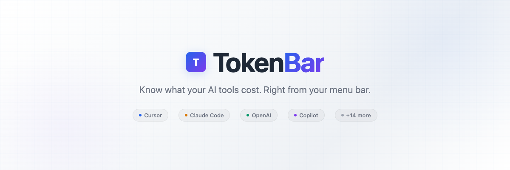
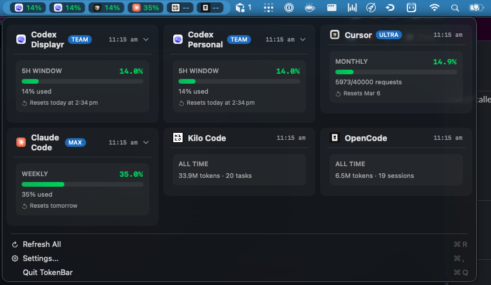

<p align="center">
  <picture>
    <source media="(prefers-color-scheme: dark)" srcset="docs/assets/tokenbar-banner-dark.png">
    <source media="(prefers-color-scheme: light)" srcset="docs/assets/tokenbar-banner-light.png">
    
  </picture>
</p>

<p align="center">
  <strong>Know what your AI tools cost. Right from your menu bar.</strong>
</p>

<p align="center">
  <a href="https://github.com/saphid/TokenBar/releases"></a>
  <a href="https://github.com/saphid/TokenBar/blob/main/LICENSE"></a>
  <a href="https://github.com/saphid/TokenBar/stargazers"></a>
  
  
</p>

---

TokenBar is a lightweight macOS menu bar app that tracks token usage and spending across your AI coding tools. It auto-detects installed providers and shows real-time usage stats at a glance.

<!-- TODO: Add screenshot here once you have one -->
<!-- <p align="center">
  
</p> -->

## Features

- **Menu bar native** -- lives in your macOS menu bar, always one click away
- **Auto-detection** -- scans your system for installed AI tools on first launch
- **Real-time usage tracking** -- monitors token consumption and cost via provider APIs
- **Multi-provider** -- supports the tools developers actually use (see list below)
- **Keychain storage** -- API keys are stored in macOS Keychain, never in plain text
- **Zero dependencies** -- pure Swift, no Electron, no web views

## Supported Providers

### Usage Tracking (API-connected)

| Provider | What's tracked |
|----------|---------------|
| **Cursor** | Plan usage, token consumption |
| **Claude Code** | Token usage via Anthropic API |
| **OpenAI / ChatGPT** | Spend, token usage, budget tracking |
| **GitHub Copilot** | Seat usage, completions |
| **Codex** | Multi-org usage tracking |
| **Kilo Code** | Token consumption |
| **OpenCode** | Usage stats |

### Auto-Detection (presence monitoring)

Aider, Amazon Q, Cline, Cody, Continue, Gemini, Minimax, Ollama, OpenRouter, Tabnine, Windsurf, Zai

TokenBar checks for installed apps, CLI tools, and VS Code/Cursor/Windsurf extensions to detect which providers you have.

## Install

### From source (recommended)

```bash
git clone https://github.com/saphid/TokenBar.git
cd TokenBar
make install
```

This builds a release binary, bundles it into `TokenBar.app`, and copies it to `/Applications`.

### Development

```bash
git clone https://github.com/saphid/TokenBar.git
cd TokenBar
make run
```

### Requirements

- macOS 14 (Sonoma) or later
- Swift 5.10+
- Xcode Command Line Tools (`xcode-select --install`)

## How It Works

```
┌─────────────────────────────────────────────────┐
│                  macOS Menu Bar                  │
│                   ┌───────┐                      │
│                   │ $4.25 │ ← TokenBar           │
│                   └───┬───┘                      │
├───────────────────────┼─────────────────────────┤
│                       │                          │
│    ┌──────────────────▼──────────────────┐       │
│    │          ProviderManager            │       │
│    │  Orchestrates providers, polling,   │       │
│    │  config persistence, detection      │       │
│    └──────┬──────────┬──────────┬───────┘       │
│           │          │          │                │
│    ┌──────▼───┐ ┌────▼────┐ ┌──▼───────┐       │
│    │  Cursor  │ │ OpenAI  │ │ Claude   │  ...   │
│    │ Provider │ │Provider │ │ Code     │        │
│    └──────────┘ └─────────┘ └──────────┘        │
│           │          │          │                │
│    ┌──────▼──────────▼──────────▼───────┐       │
│    │         Provider APIs              │       │
│    │   (polling on configurable         │       │
│    │    intervals, usage endpoints)     │       │
│    └────────────────────────────────────┘       │
│                                                  │
│    ┌────────────────────────────────────┐       │
│    │    macOS Keychain (API keys)       │       │
│    │    UserDefaults (config, prefs)    │       │
│    └────────────────────────────────────┘       │
└─────────────────────────────────────────────────┘
```

## Configuration

On first launch, TokenBar scans your system and enables detected providers automatically. Open **Settings** (click the menu bar icon → gear) to:

- Add or remove providers
- Enter API keys (stored in Keychain)
- Set monthly budgets
- Configure display preferences
- Reorder providers

The Settings UI uses a sidebar + detail panel layout (macOS System Settings style) -- no nested dialogs.

## Project Structure

```
Sources/
├── TokenBar/              # App entry point
└── TokenBarLib/
    ├── Domain/            # Models, config schema, provider registry
    ├── Providers/
    │   ├── Trackable/     # API-connected providers (Cursor, OpenAI, etc.)
    │   └── DetectionOnly/ # Presence-detected providers (Aider, Ollama, etc.)
    └── Views/             # SwiftUI views (Settings, menu bar popover)
Tests/
└── TokenBarTests/         # Unit tests
```

## Contributing

Contributions are welcome. See [CONTRIBUTING.md](CONTRIBUTING.md) for guidelines.

**Adding a new provider**: Implement the `RegisteredProvider` protocol and add it to `ProviderRegistry.all`. For detection-only providers, define the file paths, commands, or extension patterns to check. For trackable providers, implement the API polling logic in a `UsageProvider`.

## License

MIT -- see [LICENSE](LICENSE) for details.

## Acknowledgments

Built with Swift and SwiftUI. No external dependencies.
